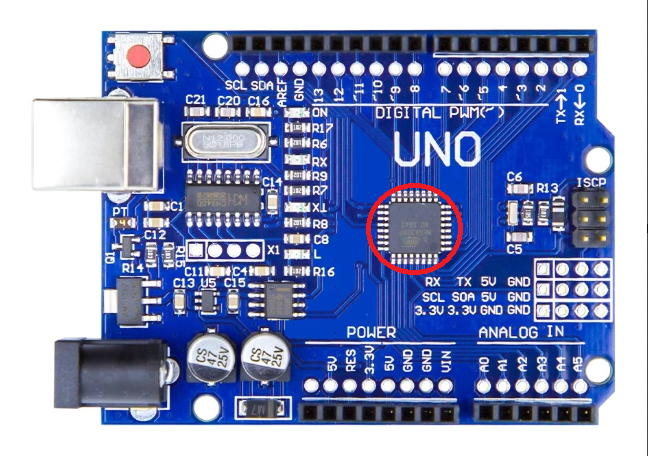

In this document you will go through the basics of what a package is, it's contents,and a deeper dive into the RTL2GDSII flow using open source tools. You will also understand what do you mean by `Instruction Set Algorithm (ISA)`, how a sofware runs on the hardware and many more topics in detail. 

# Package 
A package in the VLSI industry that is commonly placed on a microcontroller is an integrated circuit (IC) package. This package serves as both the protective casing and the interface for the semiconductor die, enabling electrical connection to printed circuit boards and providing mechanical support. The main function of the package is to house the tiny silicon chip created during the VLSI process, which contains millions of transistors and complex logic systems, such as microcontrollers or other embedded processors.




Connections are made thought wire bonds for data transfer from chip to outside world and vice versa
.png)

# Chip
The chips are mainly made up of `PADS`, `CORE` and `DIE`. The pads help in data transfer from the external environment to the chip and vice versa. The die consists of the pads and the core that hold the `macros` and `IPs`


In the below image, the `PLL`, `ADC0`, `ADC1`, `DAC` and `SRAM` are called as `Foundry IPs` and the `RICSV SoC` and `SPI` are considered as `Macros`


# Instruction Set Architecture (ISA)
It is defined as the medium of communcation between human written code and hardware. 


The main question that arises is how does the application software run on the hardware. By refering the image below we can understand that step by step. 


As you can see, the software application written in any language such as C/C++, Java, Python is sent to the System Software that consists of on an `operating system (OS)`, `compiler`, `assembler`. The main job of the OS is to:
- Handle the IO operation
- Allocate memory
- Create low level system function

The program running on the OS will have a compiler for that specific language that helps in converting the source code to an object file that contains the instructions in the specific instruction format depending upon the processor micro-architecture. The object file is then sent to the assembler that converts these instructions to thei repective binary values that are mapped to the specific process or opcode. Another intermediate is the processor code written in VHDL/Verilog that processes the binary information. The processer is hardened/fabricated by following the RTL2GDSII flow. 


# Open source tools
To achieve opensource ASIC design implementation we need the following:
- RTL Designs
- EDA Tools
- PDK Data

The collaboration between designers and fabs led to PDKs. The PDKs include:
- Device Models
- Design Rules - DRC, LVS, PEX
- I/O Libs
- Standard Cell Libraries 


Opensource RTL Designs are widely available in repositories like:
- librecores.org
- opensource.org
- github.org

Opensource EDA tools such as:
- Qflow
- OpenRoad
- OpenLane

PDK Data: Google + Skywater = 130nm Production PDK


130nm chips are cheaper for production. Intel fabricated the Intel P4EE processor that runs at 3.46 Ghz. Another example is the processor developed by OSU team that reported 327Mhz post layout clock frequency for a single cycle RV32i CPU. With pipeline, it can achieve more than 1GHz clock. 

# Implementation 
The task given is to run a design on OpenLane and perform sythesis and calculate flop-ratio and flop-ratio percentage. 
- Flop-Ratio = Number of Flip-Flops/Total Number of Cells.
- Flop-Ratio-Percentage = Flop-Ratio x 100.

To enter into the OpenLane environment for these commands:
```bash 
cd openlane
docker
./flow.tcl -interactive
package require openlane 0.9
prep -design picorv32a
```
This enters into the OpenLane environment and into the interactive mode. The `prep -design picorv32a` command helps in merging the cells and macros into a single `.lef` file. 


To run the synthesis process after creation of merged file use:
```bash
run_synthesis
```


Upon successful synthesis you will get a success message as shown


## Calculating the flop ratio
To calculate the flop-ration we have taken the sysnthesis report file 


Therefore, from the above data 
- The flop-ratio is 1613/14876 = 0.108429685 
- The percentage of flops = 0.108429685 x 100 = 10.8429685%
