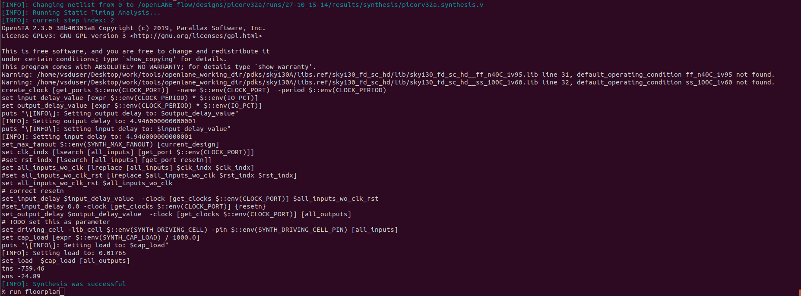
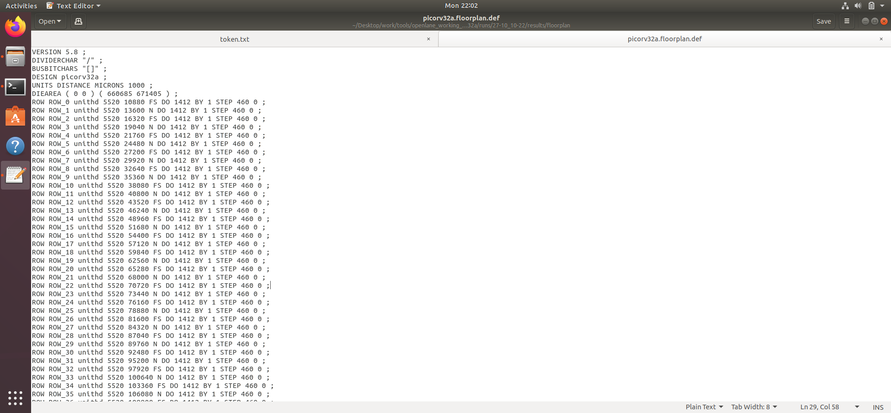
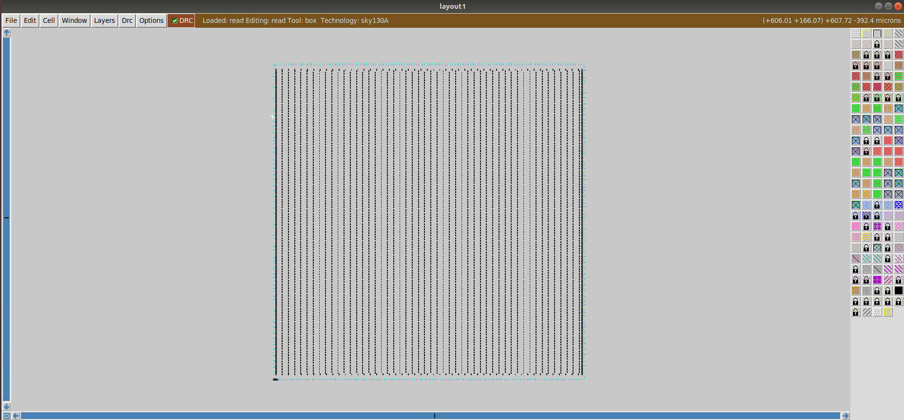
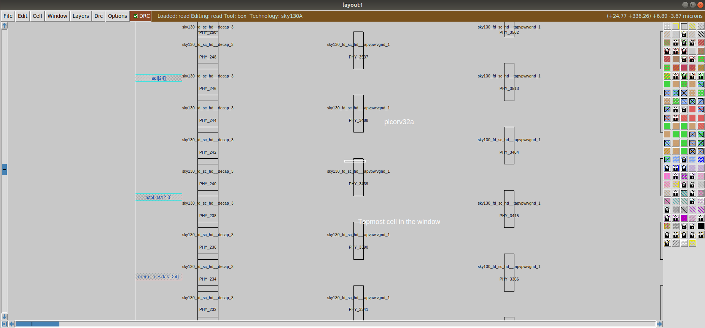
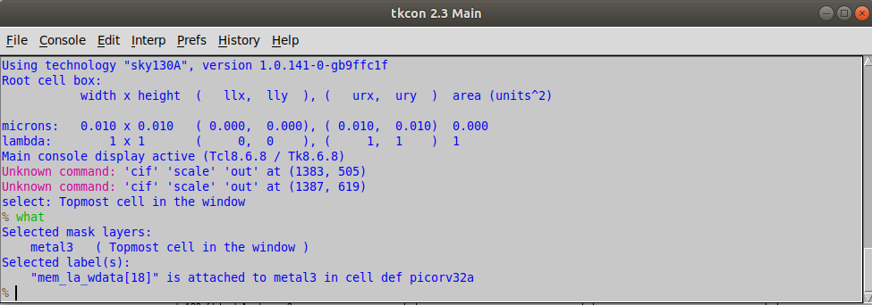
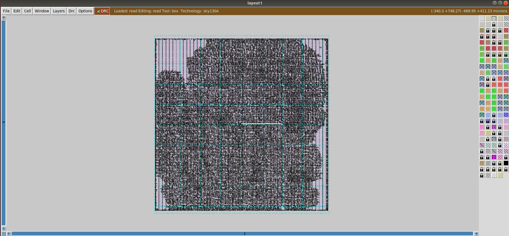
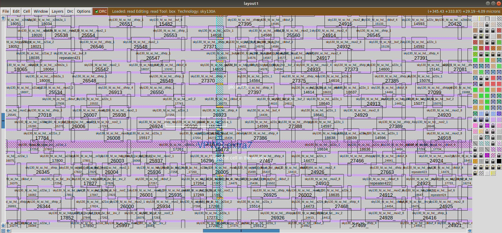

In the document you will get to see the floorplan of the picorv32a design using OpenLane flow and generate necessary outputs. We will calculate the area in microns from the floorplan def and visualize the floorplan using the opensource tools `magic`. The placement process for the picorv32a design is done and necessary outputs are generated. We will visualize the congestion aware placement of standard cells using magic again.

# Floorplan Commands

Inorder to carry out the floorplan, we need to continue from the synthesis step in OpenLane flow

```bash
cd openlane
docker
./flow.tcl -interactive
package require openlane 0.9
prep -design picorv32a
run_synthesis
run_floorplan
```



## Area Calculation 
To calculate the area in microns we take dimensions from `/reults/floorplan/picorv32a.floorplan.def` directory in runs folder.


In the above image, we can decode that 
- 1000 units = 1 Microns
- Die width = 660685-0 = 660685
- Die lenght = 671405-0 = 671405
- Distance in Microns = Value in Unit Distance/1000
- Die Width in Microns = 660685/1000 = 660.685 Microns
- Die Length in Microns = 671405/1000 = 671.405 Microns
- Area of die in Microns = 660.685 x 671.405 = 443587.212425 sq.microns

To view the floorplan on magic, go into the runs command of your design file and go to floorplan and use the command

```bash
# Change directory to path containing generated floorplan def
cd Desktop/work/tools/openlane_working_dir/openlane/designs/picorv32a/runs/27-10_10-22/results/floorplan/

# Command to load the floorplan def in magic tool
magic -T /home/vsduser/Desktop/work/tools/openlane_working_dir/pdks/sky130A/libs.tech/magic/sky130A.tech lef read ../../tmp/merged.lef def read picorv32a.floorplan.def &
```

In the above command we are linking the sky130A technology file, reading the merge file we created before synthesis and reading the .def file generated during floorplan stage. 

The output opened on magic will look like this 


We can zoom in and look at the i/o placements 


You can also check which metal later each pin is on. Simply hover over the pin, click 's' on the keyboard and another window tckon.main opens. There type 'what' to get the metal layer.


The preplaced cells can be viwed by zooming into the floorplan 


# Placement Commands

Inorder to carry out the placement, we need to continue from the floorplan step in OpenLane flow. The placement step performs congestion aware placement. 

```bash
cd openlane
docker
./flow.tcl -interactive
package require openlane 0.9
prep -design picorv32a
run_synthesis
run_floorplan
run_placement
```


## Loading the .def file into magic
To view the floorplan on magic, go into the runs command of your design file and go to floorplan and use the command

```bash
# Change directory to path containing generated placement def
cd Desktop/work/tools/openlane_working_dir/openlane/designs/picorv32a/runs/27-10_10-22/results/placement/

# Command to load the placement def in magic tool
magic -T /home/vsduser/Desktop/work/tools/openlane_working_dir/pdks/sky130A/libs.tech/magic/sky130A.tech lef read ../../tmp/merged.lef def read picorv32a.placement.def &
```

In the above command we are linking the sky130A technology file, reading the merge file we created before synthesis and reading the .def file generated during floorplan stage. 

The output of the placement process looks like the below image 


Upon zooming in we can view the standard cells used 
