In this document we will go through SPICE simulation of a inverter cell whose SPICE deck is obtained from the layout of an inverter on the opensource tool `magic`. We open a custom inverter design in magic and extract the post-layout SPICE deck for SPICE simulation. The document also goes through simple DRC violations that are fixed by updating the `sky130A.tech` file. 

# Custom Inverter Layout
Inorder to open the custom inverter layout on magic, we must clone the github repo given below

```bash 
cd Desktop/work/tools/openlane_working_dir/openlane
git clone https://github.com/nickson-jose/vsdstdcelldesign
cd vsdstdcelldesign
cp /home/vsduser/Desktop/work/tools/openlane_working_dir/pdks/sky130A/libs.tech/magic/sky130A.tech .
ls -ltr
```

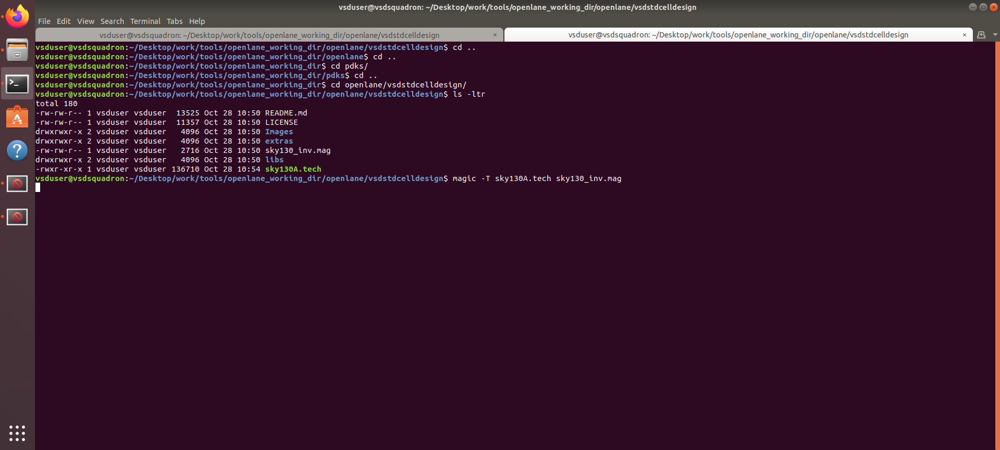

Run the command below to open the inverter layout in magic 

```bash
magic -T sky130A.tech sky130_inv.mag &
```

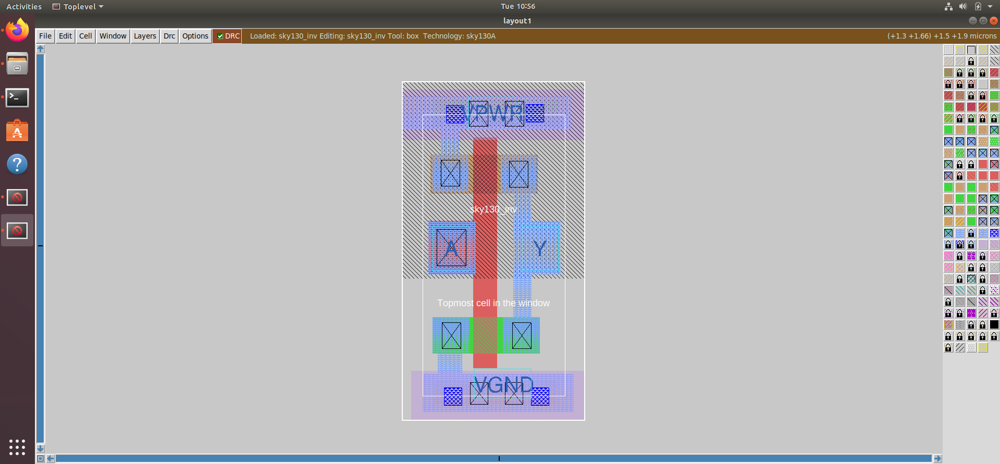

## Identification of NMOS and PMOS

To indentify NMOS and PMOS in the layout, simply hover over the white box shown in the image and press 's'. On the `tkcon 2.3 Main` file you can see it's description

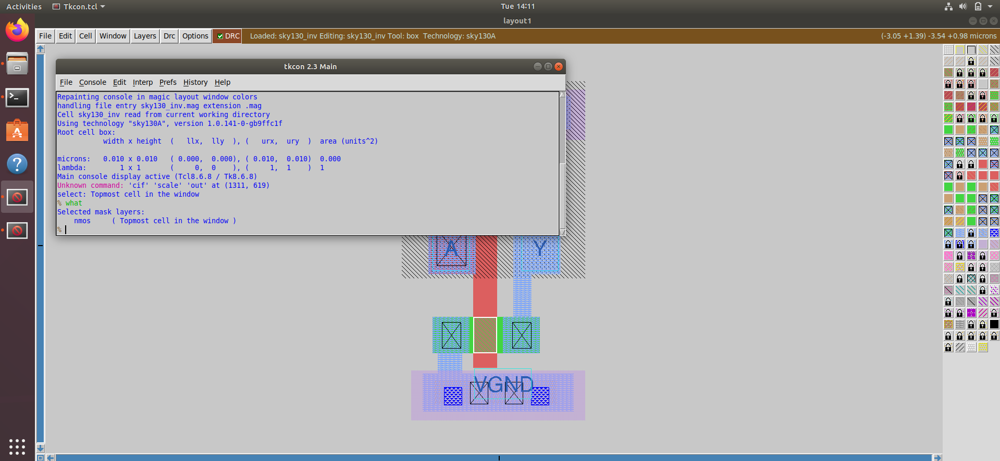
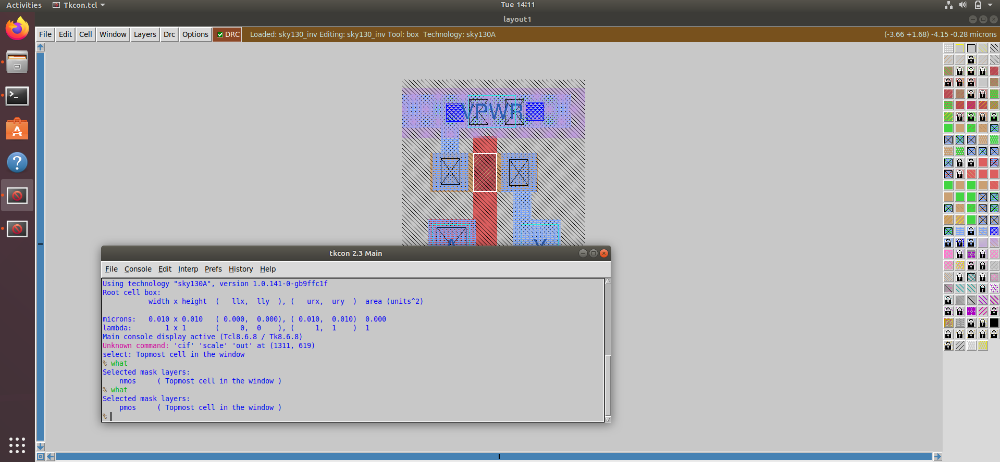

## Indentifying Correct Connections
In order to check the proper connectivity of the drain terminals of the transistor with the output port, the source terminal of PMOS with VDD and source terminal of NMOS with GND, simply hover over the terminals and press 's' two times and you will get the desired output as shown 

- Output Port Connectivity
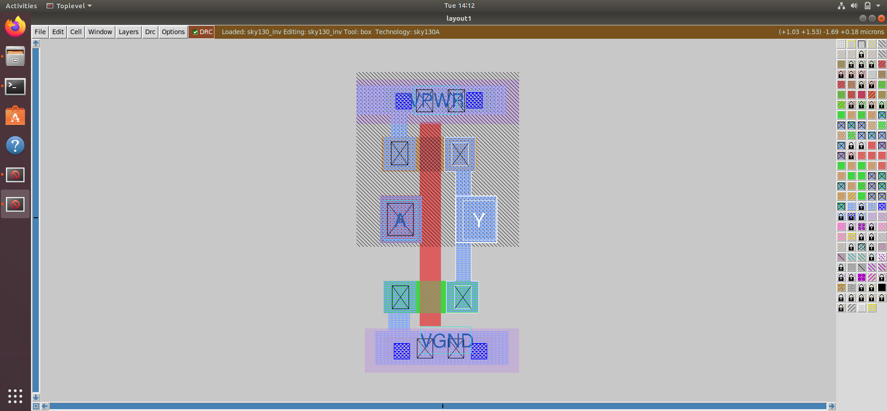

- PMOS Source with VDD


- NMOS Source with GND


## Deleting Parts to View DRC
In magic, with a predefined layout, we can delete parts to check the DRC violations as shown below:


## SPICE Extraction from Layout

We can extract the SPICE deck/netlist from the layout by following these commands. Make sure to type them in the `tkon 2.3 Main` window.

```bash
pwd
extract all
ext2spice cthresh 0 rthresh 0
ext2spice
```

- SPICE Extraction in tkon


The .spice file obtained is stored in the directory as shown below


The obtained netlist is shown below

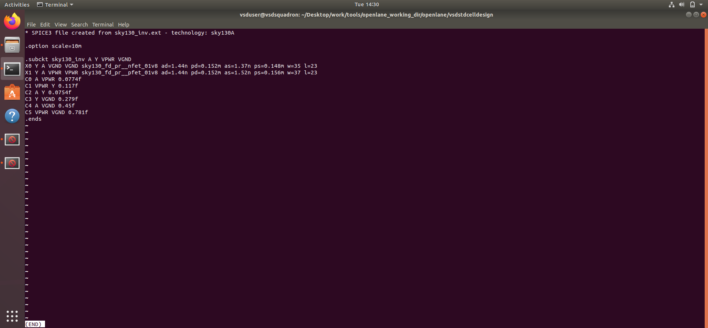

## SPICE Simulation
Inorder to run the SPICE simulation, we update the obtained inverter netlist, and add:
- Update the scale option according to the size of a `root box` which is `0.01u`
- Include library files `pshort.lib` and `nshort.lib`
- Add `DC supply` voltage of 3.3V and `Pulsating supply` of 3.3V
- Update the model names of trasistors to `pshort_model.0` and `nshort_model.0`
- Capacitance - `C6` to smoothen out sharp edges. The update netlist is shown below:
- Add command to perform `transient analysis`.


After saving the file, we go back to the terminal and perform SPICE simulation in `ngspice`. Followi these commands:

```bash
ngspice sky130A_inv.spice # enters into ngspice environment
plot y vs time a # Performs transient analysis
```
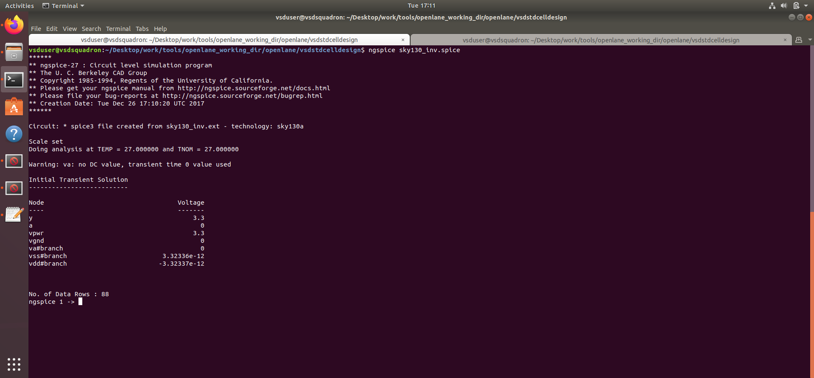

Upon running the command, we obtain the following result:


## Characterization of Inverter
From the transient analysis output, we can characterize the cell by finding it's:
- Rise Transistion Time
- Fall Transistion Time
- Rise Delay 
- Fall Delay 

Let's look at each of them one by one.

### Rise Transition Time
It is defined as the difference between output rise time at 80% voltage and 20% voltage. 
- 80% Vin = 2.64V   Time at 2.64V = 2.24669 ns
- 20% Vin = 0.66V   Time at 0.66V = 2.18234 ns

Therefore, Rise Transistion Time = 2.24669 - 2.18234 = 0.28456 ns

- Rise Transition at 20%


- Rise Transition at 80%


### Fall Transision Time
It is defined as the difference between output rise time at 80% voltage and 20% voltage. 
- 80% Vin = 2.64V   Time at 2.64V = 4.05318 ns
- 20% Vin = 0.66V   Time at 0.66V = 4.09554 ns

Therefore, Fall Transistion Time = 4.09554 - 4.05318 = 0.04236 ns

- Fall Transition at 80%


- Fall Transistion at 20%


### Rise Propogation Delay 
It is defined as the the difference in timeing values at 50% voltage between output and input during the positive edge. At 50% Vin which is equal to 1.65V 
- Input Signal Time at 1.65V = 2.14989 ns
- Outpu Signal Time at 1.65V = 2.21121 ns

Therefore, the Rise Propogation Delay = 2.21121 - 2.14989 = 0.06132 ns

- Delay at 50% Vin


### Fall Propogation Delay
It is defined as the the difference in timeing values at 50% voltage between input and output during the negative edge. At 50% Vin which is equal to 1.65V 
- Input Signal Time at 1.65V = 4.0779 ns
- Outpu Signal Time at 1.65V = 4.04986 ns

Therefore, the Rise Propogation Delay = 4.0779 - 4.04986 = 0.02804 ns

The values obtained for the calculations are shown below


# Magic Examples
This section of tasks describes how to install the examples of layouts to check for DRC violations along with changed made to correct the DRC violations. 

To get a good understanding of the Magic tool follow this link
[link](http://opencircuitdesign.com/magic/index.html)


Command to install the examples is as follows:

```bash
cd
wget http://opencircuitdesign.com/open_pdks/archive/drc_tests.tgz
tar xfz drc_tests.tgz
cd drc_tests
ls -al
gvim .magicrc
magic -d XR &
```

- Installing the tar-ball package


- Magicrc file 
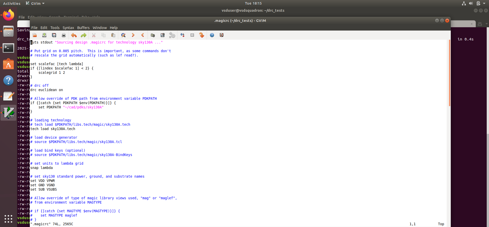

- List of examples downloaded
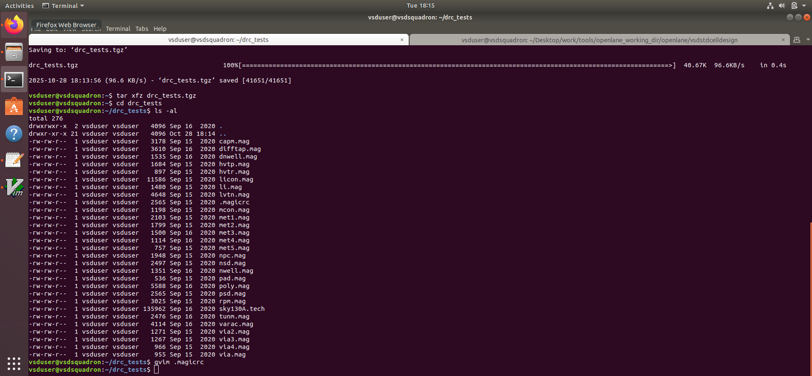

- Command to open Magic tool


## Incorrectly Implemented poly.9

- Poly Rules 


For this we load the `poly.mag` file as shown below

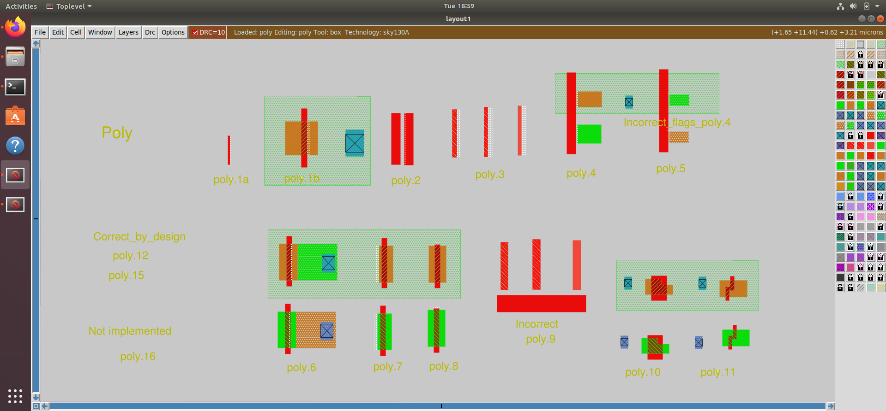

The DRC violation for the zoomed in images is shown below
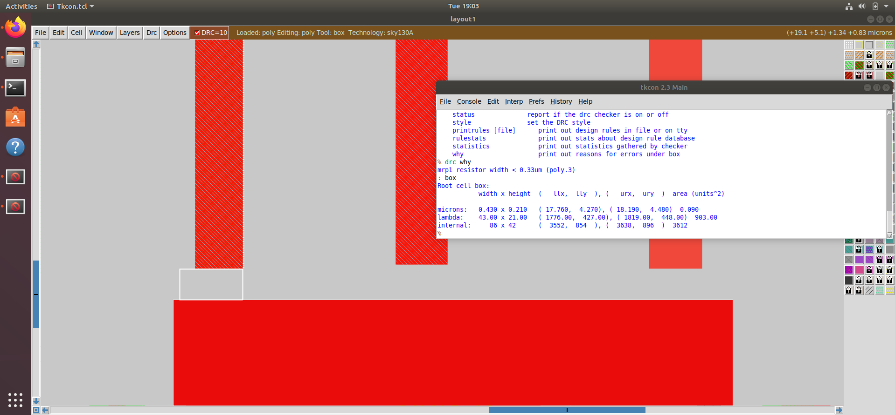

### Lines Added in sky130A.tech file
Inorder for these viloations to be fixed we add/update a few lines inside the sky130A.tech file.
- Line updation 1


- Line Updation 2


Upon saving the `sky130A.tech` file, we can simply use the command given below so that it can be used in the existing magic session in the `tkon` window. 

```bash
tech load sky130A.tech
drc check
drc why
```

### Additional Assignment


# Incorrectly Implemented nwell.4 rules
- nwell rules


No DRC violation even though no tap present 


We update the `sky130A.tech` file to fix the DRC violation

- Updating sky130A.tech file


To include updated .tech file use the commads given below in the tkon window

```bash
tech load sky130A.tech
drc check
drc why
```
- Output of DRC why


- Placing TAP and checking DRC

