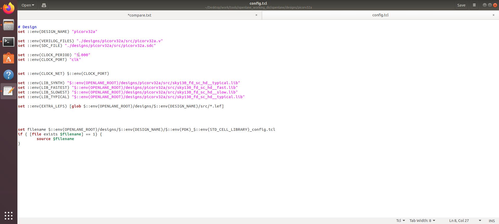
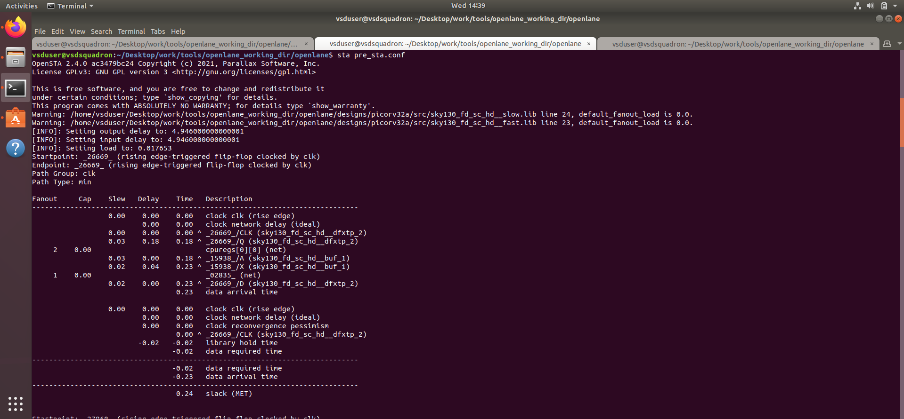
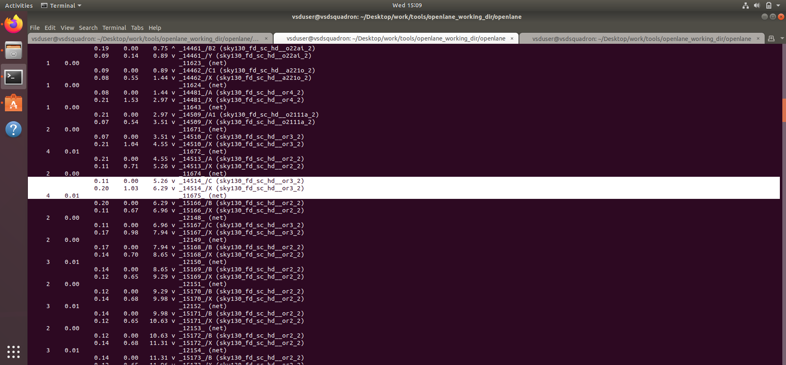
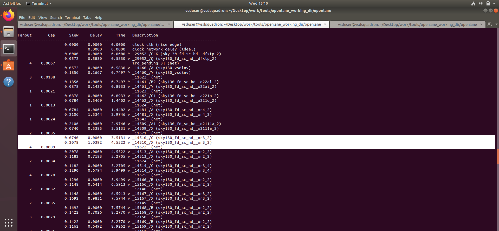
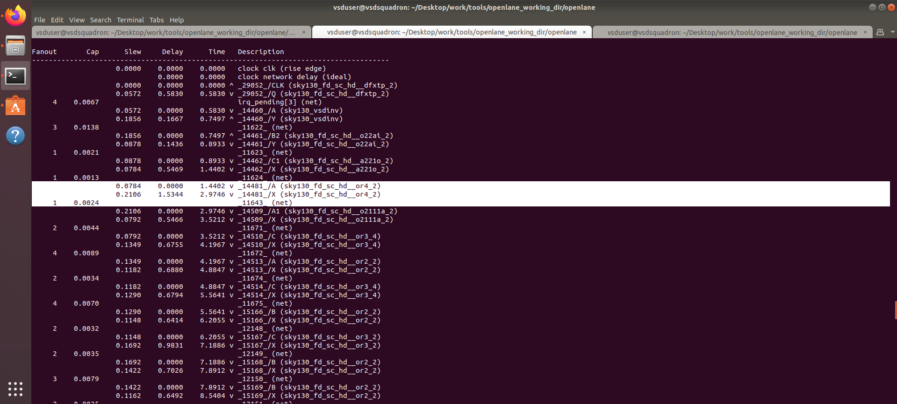
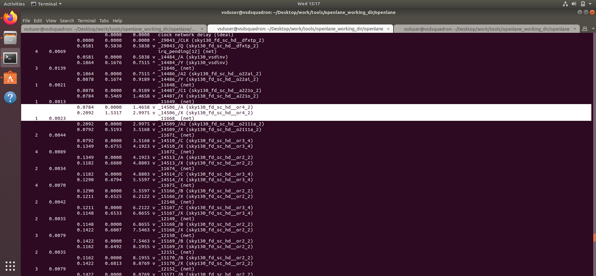
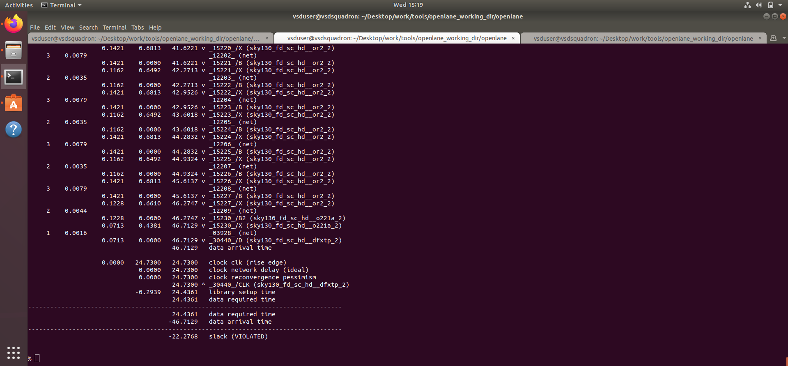
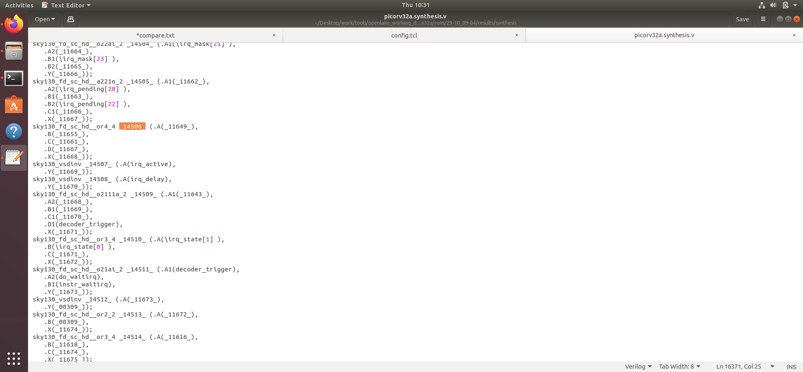
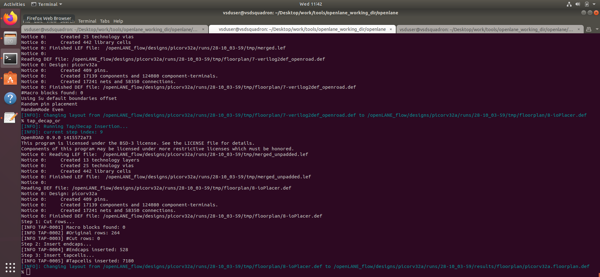

This document will give you a description of verifying the conditions for the layout of the inverter previously dicussed. It discusses on gnerating a `.lef` file from a custom saved inverter layout file and wokring on it. We insert the extracted `.lef` file into `/picorv32a/src/` directory and run a new `OpenLane` flow. Also includes detailed STA analysis of the `picorv32a` with inclusion of the custom `vsdinv` cell.The document shows working on reducing the slack by modifying the cells that have large slack and creating a new verilog netlist to run a new OpenLane flow. It works around errors finding alternate solutions and running CTS using TritonCTS for posrt-openroad CTS and also compare values for slack values by removing a buffer type and not removing it. 

# Veryfying DRC Rule 
To verify the DRC rule for heigh and width of a cell we have to modying the grid size. To modify it we take a view at the `tracks.info` file for lenght and pitch values. 


In order to activate the grid, you simlpy select the cell and press 'g'.

From there we take the `li1` x and y values and insert into the grid function in the `tkon` window. The image below shows how the grid looks before updating the grid


After updating the grid values, the grid looks like the below image


## Now to verify the rules for size of the cell, we count the number of boxes that is spans. 
- For width, the value should me an odd multiple of the cell length. 


It can be seen that the width is spanning 3 boxes, which confirms that is follows the rule. 

- For height, it should be an even multiple of the cell length 


It can be seen that the height is spanning 8 boxes, which confirms the rule. 

# Creating the Custom Inverter Cell 

In the `sky130_inv.mag` file, save it at `sky130_vsdinv.mag` by entering the below command in the tkon window


Next, close the `sky130_inv.mag` file and open `sky130_vsdinv.mag` by entering the command in the terminal

```bash 
magic -T sky130A.tech sky130_vsdinv.mag
```

Now generate the `.lef` file from the opened magic inverter layout


The extracted `sky130_vsdinv.lef` file is shown below 


Now we copy the `.lef` file created into the `/picorv32a/src` directory along with the library files. 

```bash 
cp sky130_vsdinv.lef ~/Desktop/work/tools/openlane_working_dir/openlane/designs/picorv32a/src/
ls ~/Desktop/work/tools/openlane_working_dir/openlane/designs/picorv32a/src/
cp libs/sky130_fd_sc_hd__* ~/Desktop/work/tools/openlane_working_dir/openlane/designs/picorv32a/src/
ls ~/Desktop/work/tools/openlane_working_dir/openlane/designs/picorv32a/src/
```


# Editing TCL file 
We edit the `config.tcl` inside the `/picorv32a/` folder by adding these lines 

```bash 
set ::env(LIB_SYNTH) "$::env(OPENLANE_ROOT)/designs/picorv32a/src/sky130_fd_sc_hd__typical.lib"
set ::env(LIB_FASTEST) "$::env(OPENLANE_ROOT)/designs/picorv32a/src/sky130_fd_sc_hd__fast.lib"
set ::env(LIB_SLOWEST) "$::env(OPENLANE_ROOT)/designs/picorv32a/src/sky130_fd_sc_hd__slow.lib"
set ::env(LIB_TYPICAL) "$::env(OPENLANE_ROOT)/designs/picorv32a/src/sky130_fd_sc_hd__typical.lib"

set ::env(EXTRA_LEFS) [glob $::env(OPENLANE_ROOT)/designs/$::env(DESIGN_NAME)/src/*.lef]
```

- Updated TCL File


# Running the OpenLane flow
```bash 
cd Desktop/work/tools/openlane_working_dir/openlane
docker
./flow.tcl -interactive
package require openlane 0.9
prep -design picorv32a
set lefs [glob $::env(DESIGN_DIR)/src/*.lef]
add_lefs -src $lefs
run_synthesis
```


- Chip area before synthesis stratagies


# Improving Timing 

To improve timing run the below commands
```bash 
prep -design picorv32a -tag 28-10_03-59 -overwrite
set lefs [glob $::env(DESIGN_DIR)/src/*.lef]
add_lefs -src $lefs
echo $::env(SYNTH_STRATEGY)
set ::env(SYNTH_STRATEGY) "DELAY 3"
echo $::env(SYNTH_BUFFERING)
echo $::env(SYNTH_SIZING)
set ::env(SYNTH_SIZING) 1
echo $::env(SYNTH_DRIVING_CELL)
run_synthesis
```
## Included Macro in merge.lef file
- Merged Lef file


- Running commands to reduce slack


```bash 
run_floorplan
```
- Running floorplan


```bash
run_placement
```

- Chip area after synthesis stratagies


## Loading placement on Magic
```bash
cd Desktop/work/tools/openlane_working_dir/openlane/designs/picorv32a/runs/24-03_10-03/results/placement/
magic -T /home/vsduser/Desktop/work/tools/openlane_working_dir/pdks/sky130A/libs.tech/magic/sky130A.tech lef read ../../tmp/merged.lef def read picorv32a.placement.def &
```

- Finding the custom `sky130_vsdinv` cell


Type the following command after selecting the custom vsdinv cell in tkon window and you will get a visualization of the metal connections.
```bash
expand
```


# Post-synthesis Time Analysis

The design after using the `SYNTH_STRATEGIES` gave `tns = 0` and `wns = 0` which gives a completley optimistic design. In this section we are going to try and reduce slack using OpenSTA by modifying cells. For this, entering into a new OpenLane flow is preferable. Run the same commands as before. 

```bash 
cd Desktop/work/tools/openlane_working_dir/openlane
docker
./flow.tcl -interactive
package require openlane 0.9
prep -design picorv32a
set lefs [glob $::env(DESIGN_DIR)/src/*.lef]
add_lefs -src $lefs
run_synthesis
```
Now create a `pre_sta.conf` file containing the following 


Next create a `my_base.sdc` file in `/openlane/designs/picorv32a/src/` directory, based on the file `/openlane/scripts/base.sdc`


## Running the pre_sta.conf file

Run the STA configure file by following the commands

```bash
cd Desktop/work/tools/openlane_working_dir/openlane
sta pre_sta.conf
```



## Run OpenLane by minimizing FANOUT

To reduce the fanout of each cell, we adopt another `SYNTH_STRATEGY` by following the commands

```bash 
prep -design picorv32a -tag 29-10_09-04 -overwrite
set lefs [glob $::env(DESIGN_DIR)/src/*.lef]
add_lefs -src $lefs
set ::env(SYNTH_SIZING) 1
# Setting new value for Fanout
set ::env(SYNTH_MAX_FANOUT) 4
echo $::env(SYNTH_DRIVING_CELL)
run_synthesis
```


## Run OpenSTA again 
Run OpenSTA again on the new fanout design 
```bash
cd Desktop/work/tools/openlane_working_dir/openlane
sta pre_sta.conf
```


### Timing ECO to Minimize Slack
- OR gate of drive strenght 2 is driving 4 cells 


To analyze the net and modify the cells follow these commands
```bash 
report_net -connections _11675_
help replace_cell
replace_cell _14514_ sky130_fd_sc_hd__or3_4
report_checks -fields {net cap slew input_pins} -digits 4
```


Change in slack observed is 


Similarly, perform the same for other cells with high fanouts and delays

```bash 
report_net -connections _11672_
help replace_cell
replace_cell _14510_ sky130_fd_sc_hd__or3_4
report_checks -fields {net cap slew input_pins} -digits 4
```


Change in slack observed is



```bash 
report_net -connections _11643_
help replace_cell
replace_cell _14481_ sky130_fd_sc_hd__or4_4
report_checks -fields {net cap slew input_pins} -digits 4
```


Change in slack observed is



```bash 
report_net -connections _11668_
help replace_cell
replace_cell _14506_ sky130_fd_sc_hd__or4_4
report_checks -fields {net cap slew input_pins} -digits 4
```


Change in slack observed is


## Finding how much slack has been reduced
Inorder to figure out how much slack have we reduced from the initial slack value by modifying cells, run this command 
```bash
report_checks -from _29043_ -to _30440_ -through _14506_
```


Clearly it can be observed that the initial value of slack was -23.89 and it has been reduced to -22.27. This shows a significant improvment in slack by 1.62ns. 

# Replacing the Old Netlist

After running the ECO timing checks, we replace the old netlist containing the higher slack value, by creating a new netlist with the lower slack value by following these commands in the OpenSTA environment. 

```bash
help write_verilog
write_verilog /home/vsduser/Desktop/work/tools/openlane_working_dir/openlane/designs/picorv32a/runs/25-03_18-52/results/synthesis/picorv32a.synthesis.v
exit
```

## Verifying if netlist has been updated
In the below image it can be seen that, the cell `_14506_` has been updated from OR gate with drive strength 2 to OR gate of drive strength 4. 


Since we have verified that the design has been overwritten, we can continue with the PnR flow on OpenLane. The next step is floor plan. To carry out floorplan, run the following command

```bash
run_floorplan
```

Incase you get an unexpected error as shown below


Run these commands instead to avoid the unexpected error

```bash 
init_floorplan
place_io
tap_decap_or
```

- Screenshot of running `init_floorplan` and `place_io`


- Screenshot of running `tap_decap_or`


After floorplan, run placement command 
```bash
run_placement
```

- Successfully Ran Placement


Now, after placement run CTS 

```bash
run_cts
```
- CTS Success


# Post CTS OpenRoad Timing Analysis

Once the CTS is completed successfully, we have to perform timing analysis again since there will be clock buffers added into the design. To carry out the timing analysis, we use the OpenRoad environment. Use these commands to carry out the timing analysis

```bash
openroad
read_lef /openLANE_flow/designs/picorv32a/runs/29-10_09-04/tmp/merged.lef # Reading .lef file
read_def /openLANE_flow/designs/picorv32a/runs/29-10_09-04/results/cts/picorv32a.cts.def # Reading .def file
write_db pico_cts.db # Creates an OpenRoad DB
read_db pico_cts.db # Reading the DB
read_verilog /openLANE_flow/designs/picorv32a/runs/29-10_09-04/results/synthesis/picorv32a.synthesis_cts.v # Reading verilog netlist
read_liberty $::env(LIB_SYNTH_COMPLETE)
link_design picorv32a # Linging design
read_sdc /openLANE_flow/designs/picorv32a/src/my_base.sdc
set_propagated_clock [all_clocks]
help report_checks # To use report_checks command
report_checks -path_delay min_max -fields {slew trans net cap input_pins} -format full_clock_expanded -digits 4
exit
```


- OpenRoad Analysis Hold Time


-OpenRoad Analysis Setup Slack


It can be observed that the design after CTS has a positive hold and setup slack ensuring that the timing checks are valid after CTS. 

## Assignment
In this assignment, we are checking the post CTS timing result in OpenRoad environment by removing a buffer named `sky130_fd_sc_hd__clkbuf_1` from the clock buffer list `CTS_BUFFER_LIST`. To carry out this, follow these commands in the same OpenLane enviromnet as the above analysis.

```bash 
echo $::env(CTS_CLK_BUFFER_LIST) # Lists the buffers in CTS_CLK_BUFFER_LIST
set ::env(CTS_CLK_BUFFER_LIST) [lreplace $::env(CTS_CLK_BUFFER_LIST) 0 0] # Deleting 'sky130_fd_sc_hd__clkbuf_1' from the list
echo $::env(CTS_CLK_BUFFER_LIST) # Lists the buffers in CTS_CLK_BUFFER_LIST
echo $::env(CURRENT_DEF) # Checking current value of 'CURRENT_DEF'
set ::env(CURRENT_DEF) /openLANE_flow/designs/picorv32a/runs/24-03_10-03/results/placement/picorv32a.placement.def # Setting def as placement def else error arises
run_cts # Run CTS again
echo $::env(CTS_CLK_BUFFER_LIST) # Lists the buffers in CTS_CLK_BUFFER_LIST
openroad
read_lef /openLANE_flow/designs/picorv32a/runs/29-10_09-04/tmp/merged.lef # Reading .lef file
read_def /openLANE_flow/designs/picorv32a/runs/29-10_09-04/results/cts/picorv32a.def # Reading .def file
write_db pico_cts1.db # Creates an OpenRoad DB
read_db pico_cts.db # Reading the DB
read_verilog /openLANE_flow/designs/picorv32a/runs/29-10_09-04/results/synthesis/picorv32a.synthesis_cts.v # Reading verilog netlist
read_liberty $::env(LIB_SYNTH_COMPLETE)
link_design picorv32a # Linging design
read_sdc /openLANE_flow/designs/picorv32a/src/my_base.sdc
set_propagated_clock [all_clocks]
report_checks -path_delay min_max -fields {slew trans net cap input_pins} -format full_clock_expanded -digits 4
report_clock_skew -hold # Report hold skew
report_clock_skew -setup # Report setup skew
exit # Exits OpenRoad
echo $::env(CTS_CLK_BUFFER_LIST) # Lists the buffers in CTS_CLK_BUFFER_LIST
set ::env(CTS_CLK_BUFFER_LIST) [linsert $::env(CTS_CLK_BUFFER_LIST) 0 sky130_fd_sc_hd__clkbuf_1] # Inserts 'sky130_fd_sc_hd__clkbuf_1' to first index of list
echo $::env(CTS_CLK_BUFFER_LIST) # Lists the buffers in CTS_CLK_BUFFER_LIST
```

- Removing the buffers


- CTS error due to wrong .def file link


- Fix it by changing the .def file linkning 


- Running OpenRoad again for timing analysis


- Observed hold slack after removing buffers


- Observed setup slack after removing buffers


From the above output, it can be observed that the hold and setup slacks have improved after removing the `sky130_fd_sc_hd__clkbuf_1`

- Clock Skews


